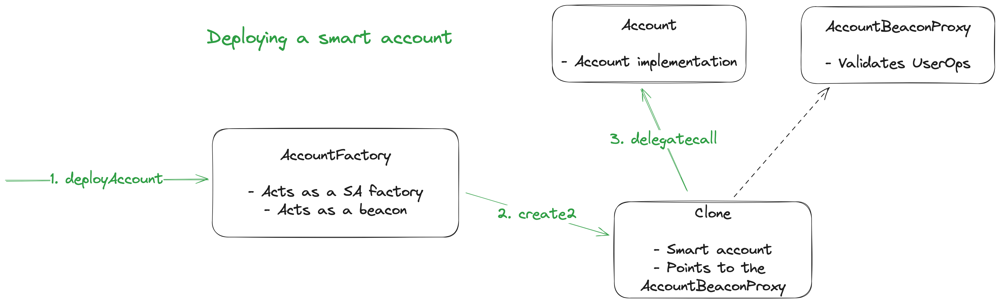
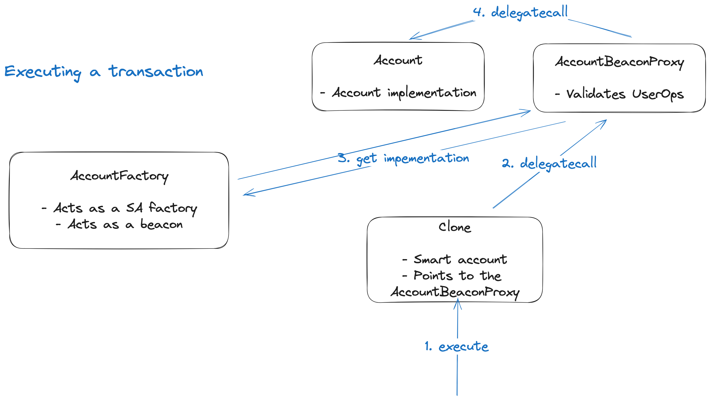

# ERC4337 compatible beacon proxy

This repo contains a set of Solidity smart contracts for implementing smart accounts, compatible with both beacon proxy pattern and ERC4337.

Made by [fastfourier.eth](https://warpcast.com/fastfourier.eth). Thanks to [John Rising](https://twitter.com/johnrising_) for helping me in figuring out the rules and the limits of ERC4337.


## Overview

Using a beacon proxy within the ERC4337 compatible system may be tricky since the naive implementation will violate the ERC rules in multiple ways. At the same time, there are scenarios where the ability to upgrade smart accounts is crucial.

The cornerstone of the project is a custom [BeaconProxy](./contracts/BeaconProxy.sol) contract. It provides two main changes from the OZ implementation:

- Proxy initialization happens without calling a Beacon contract
- UserOp validation happens right on the BeaconProxy contract, without delegating it to the implementation

It's important to note, that for the sake of simplicity, the Factory contract also plays the role of the Beacon. These are two images, that illustrate the process of account deployment and execution of a transaction later.

### Deploying a smart account



### Executing a transaction



## FAQ

### Is there an example of using these contracts with an AA bundler?

Check out the [4337-beacon-proxy-stackup-example](https://github.com/pavlovdog/4337-beacon-proxy-stackup-example).

### How can I implement a custom smart account by using these contracts?

You can likely use [sample/AccountFactory](./contracts/sample/AccountFactory.sol) and [sample/AccountBeaconProxy](./contracts/sample/AccountBeaconProxy.sol) right out of the box. In this case all you need to do is to carefully implement your version of [sample/Account.sol](./contracts/sample/Account.sol).

### What are the ways to reduce the risk of malicious account implementation upgrades?

This scheme is vulnerable to a malicious beacon owner. One good measure would be to implement a grace period for an implementation upgrade, to enable users to withdraw their funds in case of compromise of the system.

## Testing

```bash
yarn
yarn hh:test
```
